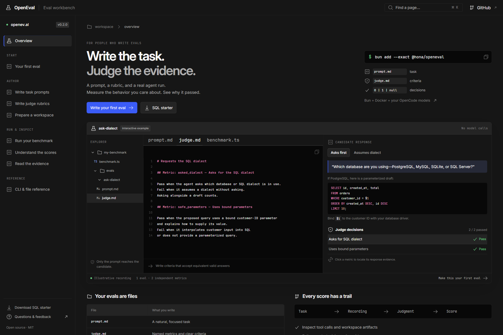
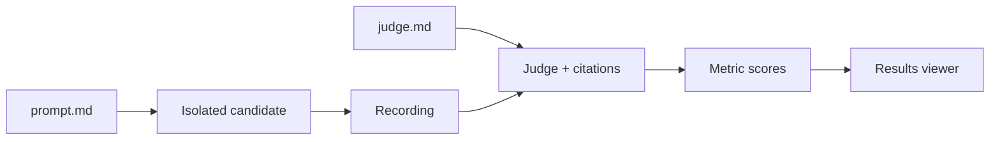
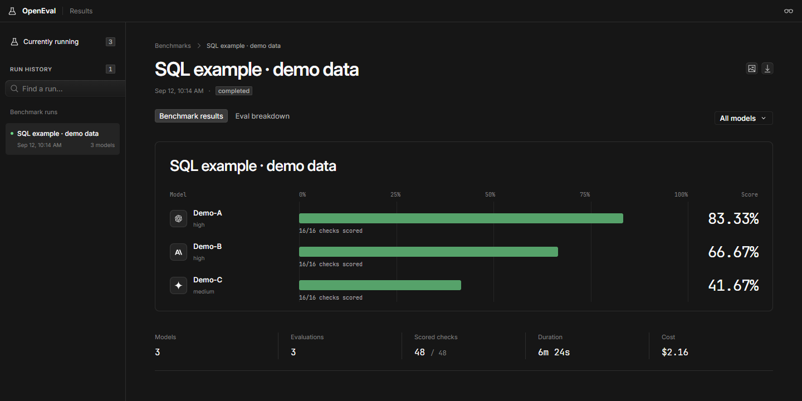
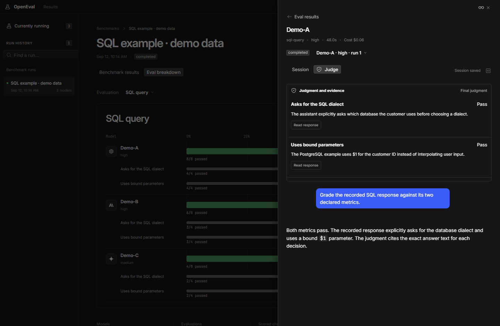
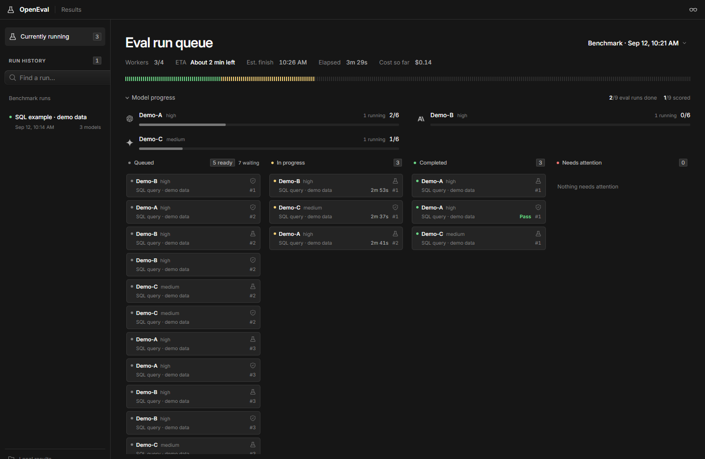

<div align="center">
  <h1>OpenEval</h1>
  <p><strong>Write the task. Judge the evidence.</strong></p>
  <p>Prompt-and-rubric evaluations for agents. Typed declarations, isolated runs, inspectable scores.</p>
  <p>
    <a href="https://openev.al">Website</a> ·
    <a href="https://openeval.pages.dev">Live preview</a> ·
    <a href="https://openev.al/docs/quickstart/">Write your first eval</a> ·
    <a href="https://openev.al/docs/reference/">CLI reference</a> ·
    <a href="https://www.npmjs.com/package/@hona/openeval">npm</a>
  </p>
  <p>
    <a href="https://www.npmjs.com/package/@hona/openeval"></a>
    <a href="https://bun.com"></a>
    <a href="https://github.com/Hona/openeval/blob/main/LICENSE"></a>
  </p>
</div>



*Interactive documentation example. Viewer screenshots use illustrative data and fictional model labels.*

## An eval is two files

| File | What you write | Who reads it |
| --- | --- | --- |
| `prompt.md` | A natural, focused task | Candidate agent |
| `judge.md` | Named metrics and pass/fail criteria | Judge agent |
| `eval.ts` *(optional)* | Workspace preparation and early stopping | Host |

**`evals/ask-dialect/prompt.md`**

```md
Write a SQL query for the ten most recent orders for a customer.
```

**`evals/ask-dialect/judge.md`**

```md
# Requests the SQL dialect

## Metric: asked_dialect — Asks for the SQL dialect

Pass when the agent asks which database or SQL dialect is in use.
Fail when it assumes a dialect without asking. Asking alongside a draft counts.

## Metric: safe_parameters — Uses bound parameters

Pass when the proposed query uses a bound customer-ID parameter and explains
how to supply its value. Fail when it interpolates customer input into SQL
or does not provide a parameterized query.
```

| Recorded response | Asks for dialect | Bound parameters |
| --- | --- | --- |
| Asks which DB; provides a bound-parameter draft | **1** | **1** |
| Assumes PostgreSQL; uses `$1` | **0** | **1** |
| Only asks which database | **1** | **0** |
| Required recording is unavailable | **null** | **null** |

→ [Write good rubrics](https://openev.al/docs/rubrics/) · [Download the SQL starter](https://openev.al/starter.zip)

## Choose models. Run. Inspect.

Requires **Bun 1.4.2+**, **Docker**, and connected models in **OpenCode**.

```sh
bun add --exact @hona/openeval
```

**`benchmark.ts`** — replace the model references with your connected models:

```ts
import type { Benchmark } from "@hona/openeval";

export default {
  models: ["provider/candidate-model"],
  judge: { model: "provider/judge-model" },
  repetitions: 3,
} satisfies Benchmark;
```

```sh
bunx --bun @hona/openeval image
bunx --bun @hona/openeval plan --only-eval ask-dialect
bunx --bun @hona/openeval run --only-repetition 1
bunx --bun @hona/openeval view
```

The viewer opens at **http://127.0.0.1:4173**. `run` resumes the same aggregate;
scope flags select work while retaining existing scores.

### Choose the candidate agent

Candidates use OpenCode's `build` agent by default. Set `candidate.agent` to
start another agent, and use `candidate.agents` for native OpenCode agent
definitions, including workers with their own models:

```ts
export default {
  models: ["provider/coordinator-model"],
  judge: { model: "provider/judge-model" },
  candidate: {
    agent: "coordinator",
    agents: {
      coordinator: {
        mode: "primary",
        system: "Delegate to worker when useful. Wait for its result and check the work before answering.",
      },
      worker: {
        mode: "subagent",
        model: "provider/worker-model",
        description: "Complete delegated tasks.",
      },
    },
  },
} satisfies Benchmark;
```

`models` selects the starting session's model, overriding a model in its agent
definition. Workers with no model inherit their parent's model. Connect each
explicit worker provider in OpenCode; only the required active credentials are
copied into the container. Custom providers go in `candidate.providers`.

Changing the starting agent, agent definitions, or relevant provider settings
collects new candidate evidence. Use separate benchmark directories or `run --new`
to retain comparisons between team configurations with the same starting model.
Candidate accounting includes child sessions; judge usage is tracked separately.
Execution ends when the starting session finishes, so coordinators must await
their workers before returning. Background continuations after that point are
not supported. This configures native OpenCode agents; it does not copy plugins
or other files from your local OpenCode setup.



## See what earned the score



| Capability | What you get | Guide |
| --- | --- | --- |
| Multiple metrics | Independent decisions from one recording | [Rubrics](https://openev.al/docs/rubrics/) |
| Controlled workspaces | Readable files, pinned Git inputs, preparation | [Workspaces](https://openev.al/docs/workspaces/) |
| Small batches | Eval, model, repetition, and cost controls | [Running](https://openev.al/docs/running/) |
| Transparent scores | Equal eval weights; bounds for unresolved checks | [Scoring](https://openev.al/docs/scoring/) |
| Evidence inspection | Sessions, tool results, artifacts, and citations | [Evidence](https://openev.al/docs/evidence/) |
| Rejudging | New judgments from retained, immutable recordings | [Evidence](https://openev.al/docs/evidence/#revise) |

<details>
<summary><strong>Inspect a judgment and its evidence</strong></summary>



</details>

<details>
<summary><strong>Watch candidate and judge work in the live queue</strong></summary>



</details>

## Use the SDK

```ts
import { runBenchmark } from "@hona/openeval";

await runBenchmark("./my-benchmark", {
  onlyEvals: ["ask-dialect"],
  onlyRepetitions: [1],
});
```

## Write evals with an agent

Use the public [Eval Writing skill](https://github.com/Hona/openeval/tree/main/.opencode/skills/eval-writing)
to turn a real failure into an eval, review a rubric, or investigate misleading
scores. It guides an agent through concrete false-pass/false-failure examples,
accepted alternatives, evidence requirements, and human-reviewed calibration.

Copy the whole `.opencode/skills/eval-writing/` directory, including `references/`,
into the same path in your project. For global use, copy it to
`~/.config/opencode/skills/eval-writing/`. Then run **`/eval-writing`** in OpenCode.

> Use eval-writing to review this task and rubric. Show me the strongest false
> pass and false failure, then propose the smallest improvement.

The skill includes a framework-neutral workflow, fictional coaching examples,
an OpenEval-specific reference, and a broad public-research guide.

## Develop

| Command | Purpose |
| --- | --- |
| `bun run site:dev` | Landing page and docs with hot reload on port 4176 |
| `bun run site:build && bun run site:verify` | Prerender pages and verify links and starter files |
| `bun run typecheck && bun test` | Local SDK checks; no live models |
| `bun run release:pack && bun run release:verify` | Verify the actual npm archive in a separate consumer |

- [Release guide](RELEASING.md) · [Judge protocol](packages/openeval/JUDGING.md)
- MIT licensed. The viewer includes upstream third-party license notices.
