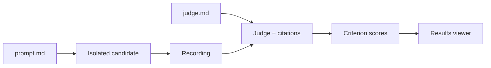

<div align="center">
  <h1>OpenEval</h1>
  <p><strong>Write the task. Judge the evidence.</strong></p>
  <p>Prompt-and-rubric evaluations for agents. Typed declarations, isolated runs, inspectable scores.</p>
  <p>
    <a href="https://openev.al">Website</a> ·
    <a href="https://openeval.pages.dev">Live preview</a> ·
    <a href="https://openev.al/docs/quickstart/">Write your first eval</a> ·
    <a href="https://openev.al/docs/reference/">CLI reference</a> ·
    <a href="https://www.npmjs.com/package/@hona/openeval">npm</a>
  </p>
  <p>
    <a href="https://www.npmjs.com/package/@hona/openeval"></a>
    <a href="https://bun.com"></a>
    <a href="https://github.com/Hona/openeval/blob/main/LICENSE"></a>
  </p>
</div>


*Interactive documentation example. Viewer screenshots use illustrative data and fictional model labels.*

## An eval is two files

| File | What you write | Who reads it |
| --- | --- | --- |
| `prompt.md` | A natural, focused task | Candidate agent |
| `judge.md` | A rubric with named criteria and scoring rules | LLM judge |
| `eval.ts` *(optional)* | Workspace preparation and early stopping | Host |

**`evals/ask-dialect/prompt.md`**

```md
Write a SQL query for the ten most recent orders for a customer.
```

**`evals/ask-dialect/judge.md`**

SDK 0.2.2 uses the legacy `## Metric:` spelling below to declare a **criterion**.
The canonical `## Criterion:` spelling is planned for 0.3.0. See
[release compatibility](https://openev.al/docs/terminology/#compatibility).

```md
# Requests the SQL dialect

## Metric: asked_dialect — Asks for the SQL dialect

Pass when the agent asks which database or SQL dialect is in use.
Fail when it assumes a dialect without asking. Asking alongside a draft counts.

## Metric: safe_parameters — Uses bound parameters

Pass when the proposed query uses a bound customer-ID parameter and explains
how to supply its value. Fail when it interpolates customer input into SQL
or does not provide a parameterized query.
```

| Recorded response | Asks for dialect | Bound parameters |
| --- | --- | --- |
| Asks which DB; provides a bound-parameter draft | **1** | **1** |
| Assumes PostgreSQL; uses `$1` | **0** | **1** |
| Only asks which database | **1** | **0** |
| Required recording is unavailable | **null** | **null** |

→ [Write good rubrics](https://openev.al/docs/rubrics/) · [Download the SQL starter](https://openev.al/starter.zip)

## One vocabulary

A **benchmark** contains **evals**. Each eval defines a task and a **rubric**.
**Judges** produce **scores** for the rubric's **criteria**. Runs also record
**metrics** such as cost, tokens, and tool reliability.

- A **criterion** is a named requirement being graded, such as `safe_parameters`.
- A **score** is awarded credit, normalized from 0 to 1, or an aggregate of it.
- A **metric** is an observed or calculated measurement. A criterion must
  explicitly use that measurement for it to affect the grade.
- A **judgment** is the judge's output. **BenchmarkRun**, **EvalRun**, and
  **JudgeRun** name recorded executions, rather than reusable definitions.

See the [canonical terminology](https://openev.al/docs/terminology/) and the
[website glossary](https://openev.al/docs/terminology/). The published SDK remains
LLM-judged; the glossary identifies the planned 0.3.0 code-judging names separately.

## Choose models. Run. Inspect.

Requires **Bun 1.4.2+**, **Docker**, and connected models in **OpenCode**.

```sh
bun add --exact @hona/openeval
```

**`benchmark.ts`** — replace the model references with your connected models:

```ts
import type { Benchmark } from "@hona/openeval";

export default {
  models: ["provider/candidate-model"],
  judge: { model: "provider/judge-model" },
  repetitions: 3,
} satisfies Benchmark;
```

```sh
bunx --bun @hona/openeval image
bunx --bun @hona/openeval plan --only-eval ask-dialect
bunx --bun @hona/openeval run --only-repetition 1
bunx --bun @hona/openeval view
```

The viewer opens at **http://127.0.0.1:4173**. `run` resumes the same aggregate;
scope flags select work while retaining existing scores.

To remove a model from an existing aggregate, remove its entry from
`benchmark.ts`, then retire its active selections:

```sh
bunx --bun @hona/openeval snapshot ./results/RUN before-model-removal
bunx --bun @hona/openeval remove-models ./results/RUN --model provider/retired-model
```

This retains the model's recorded executions, judgments, and artifacts. It
does not run candidates or judges, and requires a stopped benchmark run.
Models still declared in `benchmark.ts` can be added back by a later `run`.



## See what earned the score


| Capability | What you get | Guide |
| --- | --- | --- |
| Multiple criteria | Independent scores from one recording | [Rubrics](https://openev.al/docs/rubrics/) |
| Controlled workspaces | Readable files, pinned Git inputs, preparation | [Workspaces](https://openev.al/docs/workspaces/) |
| Small batches | Eval, model, repetition, and cost controls | [Running](https://openev.al/docs/running/) |
| Transparent scores | Equal eval weights; bounds for unresolved checks | [Scoring](https://openev.al/docs/scoring/) |
| Evidence inspection | Sessions, tool results, artifacts, and citations | [Evidence](https://openev.al/docs/evidence/) |
| Rejudging | New judgments from retained, immutable recordings | [Evidence](https://openev.al/docs/evidence/#revise) |

<details>
<summary><strong>Inspect a judgment and its evidence</strong></summary>


</details>

<details>
<summary><strong>Watch candidate and judge work in the live queue</strong></summary>


</details>

## Use the SDK

```ts
import { runBenchmark } from "@hona/openeval";

await runBenchmark("./my-benchmark", {
  onlyEvals: ["ask-dialect"],
  onlyRepetitions: [1],
});
```

## Write evals with an agent

Use the public [Eval Writing skill](https://github.com/Hona/openeval/tree/main/.opencode/skills/eval-writing)
to turn a real failure into an eval, review a rubric, or investigate misleading
scores. It guides an agent through concrete false-pass/false-failure examples,
accepted alternatives, evidence requirements, and human-reviewed calibration.

Copy the whole `.opencode/skills/eval-writing/` directory, including `references/`,
into the same path in your project. For global use, copy it to
`~/.config/opencode/skills/eval-writing/`. Then run **`/eval-writing`** in OpenCode.

> Use eval-writing to review this task and rubric. Show me the strongest false
> pass and false failure, then propose the smallest improvement.

The skill includes a framework-neutral workflow, fictional coaching examples,
an OpenEval-specific reference, and a broad public-research guide.

## Develop

| Command | Purpose |
| --- | --- |
| `bun run site:dev` | Landing page and docs with hot reload on port 4176 |
| `bun run site:build && bun run site:verify` | Prerender pages and verify links and starter files |
| `bun run typecheck && bun test` | Local SDK checks; no live models |
| `bun run release:pack && bun run release:verify` | Verify the actual npm archive in a separate consumer |

- [Release guide](https://github.com/Hona/openeval/blob/main/RELEASING.md) · [Judge protocol](JUDGING.md)
- MIT licensed. The viewer includes upstream third-party license notices.
