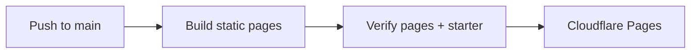

# openev.al

Static landing page and documentation for eval authors, built with Solid and the
same `@opencode/ui` components, OC-2 theme, and fonts as the results viewer.

| Command, from the repository root | Purpose |
| --- | --- |
| `bun run site:dev` | Hot reload at http://127.0.0.1:4176 |
| `bun run site:build` | Client build, SSR build, and static page generation |
| `bun run site:verify` | Verify pages, links, assets, and the downloadable starter |
| `bun run site:test` | Desktop, phone, tablet, and iPhone/WebKit reading and geometry checks |

Install the test browsers once with `bunx --no-install playwright install chromium webkit --only-shell`
from `packages/website`.

## Content

- `src/content.ts`: overview copy, documentation pages, code samples, tables, and navigation.
- `../../agent-start.md`: source-controlled agent setup prompt, copied verbatim by the overview and published at `/agent-start.md`.
- `src/examples.ts`: example evals, package version, and downloadable starter.
- `src/app.tsx`: documentation shell and page navigation.
- `src/landing.tsx`: numbered Task, Judge, Run, Inspect, and Compare overview with the shared viewer chart.
- `demo/benchmark.ts`: typed model configuration used by the overview and displayed verbatim in Compare.
- `src/components.tsx`: copy controls, code blocks, documentation screenshots, and score explorer.
- `src/styles.css`: compact layouts using OC-2 theme tokens.
- `prepare.ts`: copy public screenshots and produce the starter ZIP.
- `build.ts`: prerender all routes, metadata, sitemap, and the 404 page.
- `github-stars.ts`: fetch the star count at build time; the header needs no browser API request.
- `markdown.ts` and `agent-files.ts`: generate the documentation index, Markdown pages, and public skill downloads from their existing sources.
- `negotiation.ts` and `worker.ts`: select prebuilt Markdown through the HTTP Accept header.
- `agent-plugin.ts`: matching Markdown responses in development and static preview.

Use [the canonical vocabulary](../../TERMINOLOGY.md) in every label, example,
caption, and authoring guide. Criteria are graded requirements; scores are
awarded credit; metrics are measurements. The terminology page is checked against
the root glossary during CI and `site:verify`. Runnable examples target 0.3.0
with `## Criterion:` headings and plain JudgeContext functions.

Pages contain readable HTML before JavaScript loads. JavaScript adds file tabs,
search, copy controls, and illustrative interactions; it never calls a live model.

## Agent reading

Start at **https://openev.al/llms.txt**. It links to `/agent-start.md`, all ten
documentation pages at `/docs/<slug>/index.md`, the overview at `/index.md`, and
the public Eval Writing skill. Code samples are preserved verbatim.

Existing HTML URLs return the same Markdown when `Accept` prefers `text/markdown`
or `text/x-markdown`. HTML and Markdown keep separate asset cache validators;
negotiated responses include `Vary: Accept` and Markdown's `Content-Location`.
HTML pages link to their alternate and to the index. Direct Markdown URLs remain
static assets with `Content-Type: text/markdown; charset=utf-8`.

Verified against the installed **OpenCode 2.0.3** webfetch implementation and the
[V2 tools guide](https://opencode.ai/v2/docs/tools/): Markdown and text requests
prefer Markdown; HTML requests still prefer HTML even though their Accept header
also lists Markdown. OpenCode does not automatically crawl llms.txt or follow
alternate-link metadata. The copied prompt explicitly names the index.

The [V2 skills guide](https://opencode.ai/v2/docs/skills/) documents both supported
skill paths: a local `.opencode/skills/eval-writing/SKILL.md` installation from
`/eval-writing.zip`, or the HTTP catalog at `/skills/index.json`. The catalog uses
the named `eval-writing.md` entry and a content hash as its cache version.

## Visual stability

- Tab panels share a grid cell, so the longest variant reserves the space. Inactive panels are hidden and inert.
- The overview renders the interactive viewer chart. Documentation screenshot dimensions are checked against the PNG files during verification.
- Search keeps its outer bounds while only the result list changes. Score text has a reserved column.
- Theme fonts are preloaded and selected before first paint. A slow download keeps the fallback consistent across docs navigation; an explicit reload can use the warmed font cache.
- Browser checks compare protected element bounds on every animation frame. This catches click-triggered shifts that the CLS metric excludes.

## Responsive reading

- Phone and compact touch layouts use 16px reading text and search inputs, 14px code, and 44px minimum primary touch targets.
- Shared gutters align headings, panels, and actions. Safe-area insets protect the header and bottom controls on iPhones.
- Prompt and rubric prose wraps; wide reference tables and source code scroll inside their own panels.
- Mobile docs include a section outline, and screenshots have an explicit full-size action.
- Checks cover 320–430px phones, tablet portrait, and iPhone portrait/landscape in WebKit, alongside the desktop stability checks.

## Cloudflare Pages

The `openeval` Pages project is connected to `Hona/openeval`, production branch
`main`, and publishes to **https://openev.al** with these build settings:

| Setting | Value |
| --- | --- |
| Root directory | Repository root |
| Build command | `bun install --frozen-lockfile && bun run site:build && bun run site:verify` |
| Output directory | `packages/website/dist` |
| `BUN_VERSION` | `1.4.2` |
| `NODE_VERSION` | `24` |

GitHub pushes to `main` deploy through Pages' Git integration. The Pages subdomain
https://openeval.pages.dev serves the same production deployment.
All pages and Markdown are generated at build time. A small Pages advanced-mode
Worker handles content negotiation for the overview and documentation URLs;
it only selects static assets. Direct Markdown, skills, images, and scripts bypass
the Worker through `_routes.json`. Same-document browser navigation remains local.

