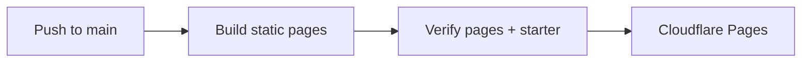

# openev.al

Static landing page and documentation for eval authors, built with Solid and the
same `@opencode/ui` components, OC-2 theme, and fonts as the results viewer.

| Command, from the repository root | Purpose |
| --- | --- |
| `bun run site:dev` | Hot reload at http://127.0.0.1:4176 |
| `bun run site:build` | Client build, SSR build, and static page generation |
| `bun run site:verify` | Verify pages, links, assets, and the downloadable starter |

## Content

- `src/content.ts`: documentation pages, code samples, tables, and navigation.
- `src/examples.ts`: the SQL example, package version, and downloadable starter.
- `src/app.tsx`: landing page and documentation shell.
- `src/components.tsx`: code blocks, workbench, screenshots, and score explorer.
- `src/styles.css`: compact layouts using OC-2 theme tokens.
- `prepare.ts`: copy public screenshots and produce the starter ZIP.
- `build.ts`: prerender all routes, metadata, sitemap, and the 404 page.

Pages contain readable HTML before JavaScript loads. JavaScript adds file tabs,
search, copy controls, and illustrative interactions; it never calls a live model.

## Cloudflare Pages

The `openeval` Pages project is connected to `Hona/openeval`, production branch
`main`, and publishes to **https://openeval.pages.dev** with these build settings:

| Setting | Value |
| --- | --- |
| Root directory | Repository root |
| Build command | `bun install --frozen-lockfile && bun run site:build && bun run site:verify` |
| Output directory | `packages/website/dist` |
| `BUN_VERSION` | `1.4.2` |
| `NODE_VERSION` | `24` |

GitHub pushes to `main` deploy through Pages' Git integration. The Pages subdomain
serves previews while the custom domain completes registration and DNS setup.
The site is static: there are no Pages Functions or application secrets.

